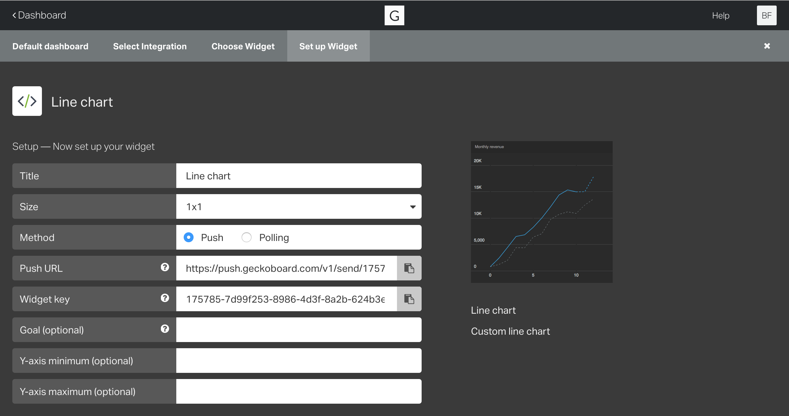
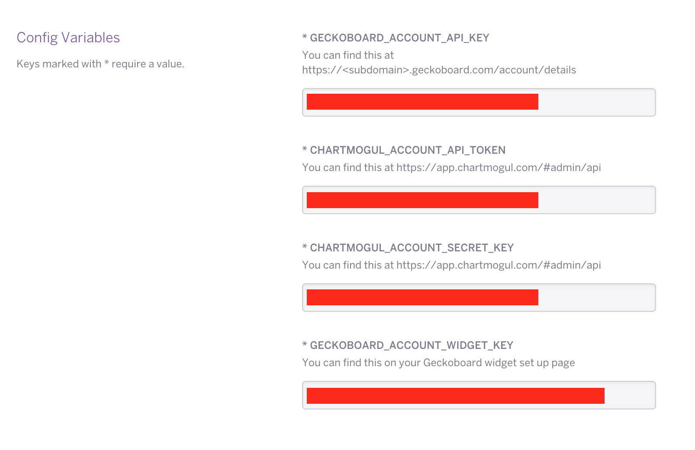
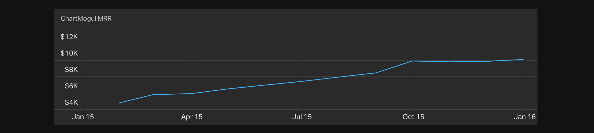

# chartmogul-geckoboard-heroku

A simple ChartMogul - Geckoboard integration written in Node.js: The one-click Heroku integration.

--------

Follow these steps to integrate your ChartMogul MRR graph into your Geckoboard:

**1. Create a custom **Line Chart widget in your Geckoboard.**

  In your Geckoboard dashboard click Add Widget > Custom Widget > Line Chart.
  
  

  Select 'Push' as the Method and click 'Add Widget'.
  
  Copy the Widget key for step 4.
  
  Click 'Save'.

**2. Create a Heroku acount:**
    
  [Sign up here](https://heroku.com/)

**3. Click the Heroku deploy button:**

  

**4. Enter your Geckoboard and ChartMogul API credentials.**

  

  Your ChartMogul API Token and Secret key can be found at [https://app.chartmogul.com/#admin/api](https://app.chartmogul.com/#admin/api) (admin permissions required).

  Your Geckoboard API key can be found at [https://<subdomain>.geckoboard.com/account/details](https://geckoboard.com/login/).

  Your Geckoboard Widget Key can be found on the Line Chart customization page (step 1).

**5. View your Geckoboard**

  The MRR Line Chart should be now updating.

  

  **Further information:**

  - [ChartMogul's Metrics API](https://github.com/chartmogul/metrics-api/blob/master/API-Documentation/api.md)
  - [The Original ChartMogul-Geckoboard integration](https://github.com/bilbof/chartmogul-geckoboard)
  - [Geckoboard documentation](https://developer.geckoboard.com/)
